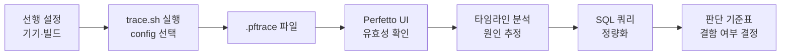
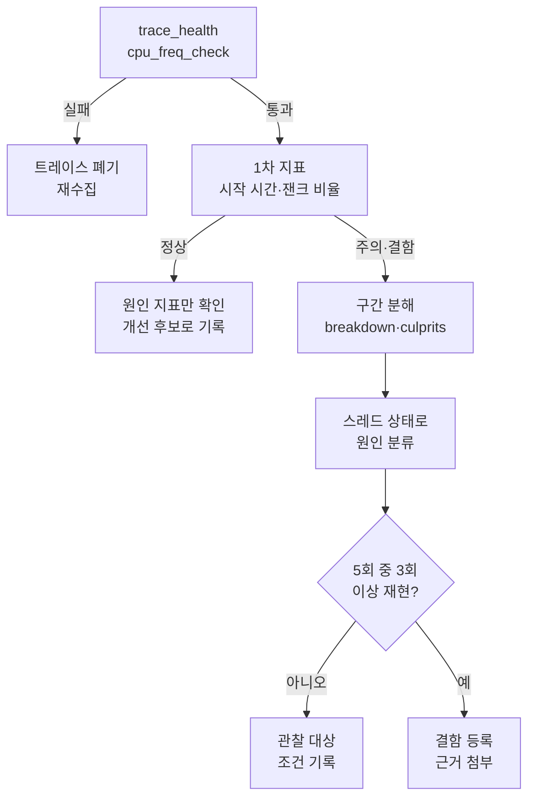

## 1. 개요

이 문서는 팀 전원이 같은 절차로 Perfetto 트레이스를 수집하고, 같은 기준으로 결함을 판단하기 위한 가이드입니다. 수집은 공식 스크립트 record\_android\_trace에 저장소에 커밋된 config 파일을 넘기는 방식(C + D)으로 통일합니다.



수집 방식별 용도는 아래와 같이 나눕니다.

| 상황 | 방식 |
| --- | --- |
| 개발자 로컬 분석(잰크, 시작 시간, 메모리) | C + D: trace.sh + configs/\*.pbtx |
| QA·현장 재현(PC 연결 불가, 간헐 이슈) | A: 기기 내 시스템 추적 |
| 새 config 설계 | ui.perfetto.dev의 Record new trace 화면에서 생성 후 configs에 저장 |
| 회귀 감시(CI) | Macrobenchmark 결과 트레이스 + queries/\*.sql 일괄 실행 |

## 2. 선행 설정

측정 전에 호스트, 기기, 앱 빌드 세 곳을 모두 맞춰야 합니다. 하나라도 빠지면 트레이스가 안 뽑히거나, 뽑혀도 수치가 왜곡됩니다.

### 2.1 호스트 PC

| 항목 | 확인 방법 | 비고 |
| --- | --- | --- |
| adb | `adb version` | Android SDK platform-tools, PATH 등록 |
| python3 | `python3 --version` | record\_android\_trace 실행용 |
| 기기 연결 | `adb devices`에 device로 표시 | unauthorized면 기기에서 USB 디버깅 허용 |
| bash | macOS·Linux 기본, Windows는 Git Bash 또는 WSL | trace.sh 실행용 |

### 2.2 기기

| 항목 | 기준 | 조치 |
| --- | --- | --- |
| OS 버전 | Android 9 이상 필수, 프레임 잰크 분류는 Android 12 이상 | 잰크 분석 기준 기기는 12 이상으로 지정 |
| traced 활성화 | Android 9 일부 기기는 꺼져 있음 | `adb shell setprop persist.traced.enable 1` |
| 구버전 perfetto | 일부 data source 미지원 | record\_android\_trace에 `--sideload` 옵션 |
| 기기 종류 | 실기기, 타깃 사용자층의 저사양 모델 포함 | 에뮬레이터 측정 금지 |

측정 편차를 줄이기 위해 기기 상태를 아래로 고정합니다.

- 배터리 세이버 OFF, 충전 상태 통일(항상 연결 또는 항상 분리)
- 개발자 옵션 > 화면 켜짐 상태 유지 ON
- 애니메이션 배율 기본값 1x 유지(잰크 측정 시 끄면 측정 의미가 사라짐)
- 직전 측정으로 기기가 뜨거우면 식힌 뒤 측정

### 2.3 앱 빌드

**1) benchmark 빌드 타입 추가**

디버그 빌드는 R8 난독화·최적화와 ART 최적화가 빠져 있어 릴리즈 대비 2\~3배 느리게 측정됩니다. 측정 전용 빌드 타입을 만들어 운영 빌드와 분리합니다.

`app/build.gradle.kts`

```kotlin
android {
    buildTypes {
        release {
            isMinifyEnabled = true
            // 기존 설정 유지
        }
        create("benchmark") {
            initWith(getByName("release"))
            signingConfig = signingConfigs.getByName("debug")
            matchingFallbacks += listOf("release")
            isDebuggable = false
        }
    }
}
```

**2) benchmark 빌드에만 profileable 선언**

`app/src/benchmark/AndroidManifest.xml` 파일을 새로 만듭니다. 이 경로의 매니페스트는 benchmark 빌드에서만 메인 매니페스트와 병합됩니다.

```xml
<?xml version="1.0" encoding="utf-8"?>
<manifest xmlns:android="http://schemas.android.com/apk/res/android">
    <application>
        <profileable android:shell="true" />
    </application>
</manifest>
```

profileable이 없으면 릴리즈 계열 빌드에서 heapprofd, Java 힙 덤프, 콜스택 샘플링이 동작하지 않습니다. 앱 슬라이스(Trace.beginSection) 수집은 없어도 동작합니다.

설치 명령은 아래와 같습니다.

```bash
./gradlew :app:installBenchmark
```

**3) 계측 라이브러리 추가**

```kotlin
dependencies {
    implementation("androidx.tracing:tracing-ktx:1.2.0")
    // Compose 사용 시
    implementation("androidx.compose.runtime:runtime-tracing:1.0.0-beta01")
}
```

계측 예시입니다. 슬라이스 이름은 상수 문자열로 두어야 SQL 집계가 가능합니다.

```kotlin
import androidx.tracing.trace

suspend fun loadDashboard() = trace("Dashboard.load") {
    val profile = trace("Dashboard.fetchProfile") { repo.profile() }
    trace("Dashboard.render") { render(profile) }
}
```

**4) ART 컴파일 상태 고정**

컴파일 상태가 측정마다 다르면 비교가 불가능합니다. 측정 목적에 맞춰 한 가지로 통일합니다.

```bash
# 실사용자 조건(베이스라인 프로파일 적용)
adb shell cmd package compile -m speed-profile -f com.kiwiplus.app

# 최악 조건(설치 직후)
adb shell cmd package compile --reset com.kiwiplus.app
```

## 3. 저장소 파일 구성

Part 2의 파일들은 자동 생성되는 것이 아니라, 앱 프로젝트 저장소 안에 직접 만들어 커밋하는 파일입니다. 목적은 팀원 누구나 저장소를 받은 뒤 명령 한 줄로 동일한 조건의 트레이스를 뽑게 하는 것입니다.

### 3.1 최종 구조

```
<프로젝트 루트>/
├── app/
├── build.gradle.kts
└── tools/
    └── perfetto/
        ├── record_android_trace     # 공식 수집 스크립트 (다운로드)
        ├── trace_processor_shell    # SQL 일괄 실행 도구 (다운로드, 커밋 제외)
        ├── trace.sh                 # 래퍼: config 선택 + 수집 (직접 작성)
        ├── startup.sh               # 콜드 스타트 측정 (직접 작성)
        ├── run_queries.sh           # 트레이스들에 SQL 일괄 실행 (직접 작성)
        ├── configs/
        │   ├── jank.pbtx            # 잰크·일반 분석 설정 (직접 작성)
        │   ├── startup.pbtx         # 시작 시간 분석 설정 (직접 작성)
        │   └── memory.pbtx          # 메모리 분석 설정 (직접 작성)
        ├── queries/
        │   └── *.sql                # 7장 쿼리 저장 (직접 작성)
        └── traces/                  # 수집 결과 (커밋 제외)
```

### 3.2 파일별 정체

| 파일 | 형식 | 역할 | 만드는 법 |
| --- | --- | --- | --- |
| record\_android\_trace | Python 스크립트 | config를 기기에 전달, 녹화, pull, 브라우저 오픈까지 자동 처리 | curl로 다운로드 |
| trace\_processor\_shell | 실행 바이너리 | 터미널에서 트레이스에 SQL 실행 | curl로 다운로드 |
| configs/\*.pbtx | protobuf 텍스트 포맷 | 무엇을, 얼마나, 어떤 버퍼로 수집할지 정의 | 에디터로 새 파일 생성 후 4장 내용 붙여넣기 |
| trace.sh | bash 스크립트 | 패키지명 치환 후 record\_android\_trace 호출 | 에디터로 생성 후 5장 내용 붙여넣기 |
| startup.sh | bash 스크립트 | 앱 종료 → 녹화 시작 → 앱 실행 순서 제어 | 에디터로 생성 후 5장 내용 붙여넣기 |
| run\_queries.sh | bash 스크립트 | traces 폴더 전체에 쿼리 일괄 실행 | 에디터로 생성 후 5장 내용 붙여넣기 |
| queries/\*.sql | SQL 텍스트 | 반복 사용하는 분석 쿼리 | 7장 쿼리를 파일별로 저장 |

pbtx는 Perfetto의 TraceConfig라는 protobuf 메시지를 사람이 읽을 수 있는 텍스트로 쓴 형식입니다. 컴파일이나 변환은 필요 없고, 텍스트 파일 그대로 perfetto에 넘기면 됩니다. 확장자는 관례일 뿐이며 .txt여도 동작합니다.

### 3.3 생성 절차

프로젝트 루트에서 아래 순서대로 실행합니다.

**Step 1. 폴더 생성**

```bash
mkdir -p tools/perfetto/{configs,queries,traces}
cd tools/perfetto
```

**Step 2. 공식 스크립트 다운로드**

```bash
curl -LO https://raw.githubusercontent.com/google/perfetto/main/tools/record_android_trace
curl -LO https://get.perfetto.dev/trace_processor
mv trace_processor trace_processor_shell
chmod +x record_android_trace trace_processor_shell
```

trace\_processor\_shell은 최초 실행 시 OS에 맞는 바이너리를 자동으로 내려받는 래퍼입니다. 용량과 OS 의존성 때문에 커밋하지 않고 각자 받게 합니다.

**Step 3. config 파일 작성**

```bash
touch configs/jank.pbtx configs/startup.pbtx configs/memory.pbtx
```

생성된 빈 파일을 Android Studio나 VS Code로 열고, 4장의 코드 블록 내용을 그대로 붙여넣습니다. 패키지명 자리에 들어간 `__PKG__`는 그대로 둡니다. trace.sh가 실행 시점에 실제 패키지명으로 바꿔 줍니다.

**Step 4. 스크립트 작성 및 실행 권한 부여**

```bash
touch trace.sh startup.sh run_queries.sh
# 5장 내용을 각 파일에 붙여넣은 뒤
chmod +x trace.sh startup.sh run_queries.sh
```

실행 권한을 git에도 기록해야 다른 팀원이 받았을 때 바로 실행됩니다.

```bash
git update-index --chmod=+x trace.sh startup.sh run_queries.sh record_android_trace
```

**Step 5. 쿼리 파일 저장**

7장의 쿼리를 용도별로 queries 폴더에 저장합니다. 파일명은 7장의 각 쿼리 제목에 적힌 이름을 따릅니다.

**Step 6. .gitignore 추가**

`tools/perfetto/.gitignore`

```
traces/
trace_processor_shell
*.pftrace
```

**Step 7. 동작 확인**

```bash
./trace.sh jank com.kiwiplus.app
```

20초 뒤 브라우저에 Perfetto UI가 열리고 traces 폴더에 파일이 생기면 구성 완료입니다.

## 4. config 파일 상세

config는 용도별로 세 개만 운영합니다. 잰크·일반 분석은 jank.pbtx, 앱 시작은 startup.pbtx, 메모리는 memory.pbtx를 쓰고, 메모리 config는 오버헤드가 커서 다른 측정과 절대 섞지 않습니다.

### 4.1 configs/jank.pbtx

가장 많이 쓰는 기본 config입니다. 스크롤 버벅임, 화면 전환 지연, 메인 스레드 블로킹 분석 전반에 사용합니다.

```protobuf
# 버퍼 0: 대량 이벤트(ftrace, 프레임)
buffers {
  size_kb: 131072
  fill_policy: RING_BUFFER
}
# 버퍼 1: 메타데이터(프로세스 이름, 패키지, 로그)
buffers {
  size_kb: 8192
  fill_policy: RING_BUFFER
}

data_sources {
  config {
    name: "linux.ftrace"
    target_buffer: 0
    ftrace_config {
      ftrace_events: "sched/sched_switch"
      ftrace_events: "sched/sched_waking"
      ftrace_events: "sched/sched_wakeup_new"
      ftrace_events: "sched/sched_process_exit"
      ftrace_events: "sched/sched_process_free"
      ftrace_events: "sched/sched_blocked_reason"
      ftrace_events: "power/cpu_frequency"
      ftrace_events: "power/cpu_idle"
      ftrace_events: "power/suspend_resume"
      ftrace_events: "task/task_newtask"
      ftrace_events: "task/task_rename"

      atrace_categories: "am"
      atrace_categories: "wm"
      atrace_categories: "gfx"
      atrace_categories: "view"
      atrace_categories: "input"
      atrace_categories: "dalvik"
      atrace_categories: "binder_driver"
      atrace_categories: "res"
      atrace_categories: "ss"
      atrace_apps: "__PKG__"

      compact_sched { enabled: true }
      symbolize_ksyms: true
      buffer_size_kb: 16384
      drain_period_ms: 250
    }
  }
}

data_sources {
  config {
    name: "linux.process_stats"
    target_buffer: 1
    process_stats_config {
      scan_all_processes_on_start: true
      proc_stats_poll_ms: 1000
    }
  }
}

data_sources {
  config {
    name: "android.packages_list"
    target_buffer: 1
  }
}

data_sources {
  config {
    name: "android.surfaceflinger.frametimeline"
    target_buffer: 0
  }
}

data_sources {
  config {
    name: "linux.sys_stats"
    target_buffer: 1
    sys_stats_config {
      meminfo_period_ms: 1000
      meminfo_counters: MEMINFO_MEM_AVAILABLE
      meminfo_counters: MEMINFO_MEM_FREE
      vmstat_period_ms: 1000
    }
  }
}

data_sources {
  config {
    name: "android.log"
    target_buffer: 1
    android_log_config {
      log_ids: LID_DEFAULT
      log_ids: LID_SYSTEM
      log_ids: LID_CRASH
    }
  }
}

duration_ms: 20000
```

### 4.2 configs/startup.pbtx

콜드 스타트 분석 전용입니다. jank.pbtx에 패키지 매니저, 디스크 I/O, 페이지 캐시 이벤트를 추가하고 녹화 시간을 줄였습니다. 붙여넣기 편하도록 전체를 적었습니다.

```protobuf
buffers {
  size_kb: 131072
  fill_policy: RING_BUFFER
}
buffers {
  size_kb: 8192
  fill_policy: RING_BUFFER
}

data_sources {
  config {
    name: "linux.ftrace"
    target_buffer: 0
    ftrace_config {
      ftrace_events: "sched/sched_switch"
      ftrace_events: "sched/sched_waking"
      ftrace_events: "sched/sched_wakeup_new"
      ftrace_events: "sched/sched_process_exit"
      ftrace_events: "sched/sched_process_free"
      ftrace_events: "sched/sched_blocked_reason"
      ftrace_events: "power/cpu_frequency"
      ftrace_events: "power/cpu_idle"
      ftrace_events: "task/task_newtask"
      ftrace_events: "task/task_rename"
      ftrace_events: "filemap/mm_filemap_add_to_page_cache"
      ftrace_events: "block/block_rq_issue"
      ftrace_events: "block/block_rq_complete"

      atrace_categories: "am"
      atrace_categories: "wm"
      atrace_categories: "gfx"
      atrace_categories: "view"
      atrace_categories: "dalvik"
      atrace_categories: "binder_driver"
      atrace_categories: "res"
      atrace_categories: "pm"
      atrace_categories: "aidl"
      atrace_categories: "disk"
      atrace_apps: "__PKG__"

      compact_sched { enabled: true }
      symbolize_ksyms: true
      buffer_size_kb: 16384
      drain_period_ms: 250
    }
  }
}

data_sources {
  config {
    name: "linux.process_stats"
    target_buffer: 1
    process_stats_config {
      scan_all_processes_on_start: true
    }
  }
}

data_sources {
  config {
    name: "android.packages_list"
    target_buffer: 1
  }
}

data_sources {
  config {
    name: "android.surfaceflinger.frametimeline"
    target_buffer: 0
  }
}

data_sources {
  config {
    name: "android.log"
    target_buffer: 1
    android_log_config {
      log_ids: LID_DEFAULT
      log_ids: LID_SYSTEM
    }
  }
}

duration_ms: 10000
```

### 4.3 configs/memory.pbtx

네이티브 힙 할당 추적(heapprofd)과 Java 힙 덤프(java\_hprof)를 수집합니다. 대상 앱이 profileable이어야 하며, 샘플링 오버헤드 때문에 이 트레이스의 시간 수치는 성능 판단에 쓰지 않습니다.

```protobuf
buffers {
  size_kb: 65536
  fill_policy: DISCARD
}

data_sources {
  config {
    name: "android.heapprofd"
    heapprofd_config {
      process_cmdline: "__PKG__"
      sampling_interval_bytes: 4096
      shmem_size_bytes: 8388608
      block_client: true
    }
  }
}

data_sources {
  config {
    name: "android.java_hprof"
    java_hprof_config {
      process_cmdline: "__PKG__"
    }
  }
}

data_sources {
  config {
    name: "linux.process_stats"
    process_stats_config {
      scan_all_processes_on_start: true
      proc_stats_poll_ms: 500
    }
  }
}

duration_ms: 15000
```

### 4.4 항목별 의미

| 항목 | 의미 | 조정 기준 |
| --- | --- | --- |
| buffers.size\_kb | 기기 메모리에 잡는 버퍼 크기 | 6.1의 데이터 손실이 보이면 2배씩 증가 |
| fill\_policy: RING\_BUFFER | 가득 차면 오래된 데이터부터 덮어씀 | 문제 발생 직후 멈추는 방식에 적합 |
| fill\_policy: DISCARD | 가득 차면 이후 데이터 버림 | 시작부터 순서가 중요한 메모리 추적에 사용 |
| target\_buffer | 이 data source가 쓸 버퍼 번호 | 메타데이터는 1번으로 분리해 덮어쓰기 방지 |
| sched\_switch / sched\_waking | 스레드가 CPU에 올라가고 내려오는 기록 | 스레드 상태 분석의 필수 이벤트, 절대 제거 금지 |
| sched\_blocked\_reason | Uninterruptible Sleep 시 커널 함수명 | I/O 대기 원인 추적용 |
| cpu\_frequency / cpu\_idle | 코어 주파수, 유휴 상태 | 스로틀링 판단용 |
| atrace\_categories | 프레임워크가 찍는 슬라이스 종류 | am=액티비티, gfx·view=렌더링, dalvik=GC·락, binder\_driver=IPC |
| atrace\_apps | 앱 자체 Trace.beginSection 수집 대상 | 빠지면 앱 커스텀 슬라이스가 전부 누락 |
| compact\_sched | 스케줄링 이벤트 압축 | 파일 크기 절반 이하로 감소 |
| buffer\_size\_kb (ftrace) | 커널 쪽 CPU별 버퍼 | 코어가 많거나 부하가 크면 증가 |
| drain\_period\_ms | 커널 버퍼를 비우는 주기 | 짧을수록 손실 감소, 오버헤드 증가 |
| frametimeline | 프레임별 기대·실제 시간, 잰크 유형 | Android 12 이상에서만 수집 |
| sampling\_interval\_bytes | heapprofd 샘플링 간격 | 작을수록 정밀, 오버헤드 증가 |
| duration\_ms | 녹화 시간 | 재현 시간 + 여유 5초 정도 |

30초를 넘기는 긴 녹화가 필요하면 config 최상단에 아래를 추가해 파일 직접 쓰기 모드로 바꿉니다.

```protobuf
write_into_file: true
file_write_period_ms: 2500
max_file_size_bytes: 1000000000
```

## 5. 스크립트 파일 상세

스크립트는 세 개입니다. trace.sh가 모든 수집의 진입점이고, startup.sh는 trace.sh를 반복 호출하는 측정 자동화, run\_queries.sh는 쌓인 트레이스를 SQL로 일괄 집계하는 도구입니다.

### 5.1 trace.sh

```bash
#!/usr/bin/env bash
# 사용법: ./trace.sh <mode> [package] [추가 옵션...]
#   mode    : configs/<mode>.pbtx (jank | startup | memory)
#   package : 기본값 DEFAULT_PKG
#   추가 옵션: record_android_trace에 그대로 전달 (예: --no-open, --sideload)
set -euo pipefail

cd "$(dirname "$0")"

DEFAULT_PKG="com.kiwiplus.app"
MODE="${1:-jank}"
PKG="${2:-$DEFAULT_PKG}"
shift $(( $# >= 2 ? 2 : $# ))
EXTRA_ARGS=("$@")

CFG_SRC="configs/${MODE}.pbtx"
OUT_DIR="traces"
OUT="${OUT_DIR}/$(date +%Y%m%d_%H%M%S)_${MODE}_${PKG##*.}.pftrace"
TMP_CFG="$(mktemp -t perfetto_${MODE}.XXXX).pbtx"

# 1. config 존재 확인
[[ -f "$CFG_SRC" ]] || { echo "config 없음: $CFG_SRC"; exit 1; }

# 2. 기기 연결 확인
adb get-state >/dev/null 2>&1 || { echo "연결된 기기 없음"; exit 1; }

# 3. 앱 설치 확인
adb shell pm path "$PKG" >/dev/null 2>&1 || { echo "앱 미설치: $PKG"; exit 1; }

# 4. 패키지명 치환
sed "s/__PKG__/${PKG}/g" "$CFG_SRC" > "$TMP_CFG"

mkdir -p "$OUT_DIR"
echo "[perfetto] mode=${MODE} pkg=${PKG}"
echo "[perfetto] out=${OUT}"

# 5. 수집 (Ctrl+C 시 즉시 중단 후 pull)
./record_android_trace -c "$TMP_CFG" -o "$OUT" "${EXTRA_ARGS[@]}"

rm -f "$TMP_CFG"
```

동작 순서는 아래와 같습니다.

1. 인자로 받은 mode에 맞는 config 파일을 고릅니다.
2. 기기 연결과 앱 설치 여부를 먼저 확인해, 녹화 후에야 실패를 알게 되는 상황을 막습니다.
3. config 안의 `__PKG__`를 실제 패키지명으로 바꾼 임시 파일을 만듭니다. 원본 config는 수정하지 않습니다.
4. record\_android\_trace에 임시 config를 넘깁니다. 스크립트가 config를 기기에 전달하고, 녹화가 끝나면 adb pull과 브라우저 오픈까지 처리합니다.
5. 결과 파일명에 날짜, 모드, 패키지 끝자리가 들어가 여러 앱을 측정해도 구분됩니다.

사용 예시입니다.

```bash
./trace.sh jank                               # 기본 앱 잰크 분석
./trace.sh jank com.kiwiplus.family           # 다른 앱
./trace.sh memory com.kiwiplus.app --no-open  # 브라우저 자동 오픈 끄기
ANDROID_SERIAL=R3CN80XXXX ./trace.sh jank     # 기기가 여러 대일 때
```

녹화 중 재현 동작(스크롤, 화면 전환)을 수행하고, 재현이 끝나면 Ctrl+C로 바로 끊어도 됩니다.

### 5.2 startup.sh

콜드 스타트를 N회 반복 측정합니다. 녹화를 먼저 켜고 앱을 실행해야 시작 구간 전체가 잡히기 때문에 순서 제어가 필요합니다.

```bash
#!/usr/bin/env bash
# 사용법: ./startup.sh [package] [반복 횟수] [compile 모드]
#   compile 모드: profile(기본, 실사용자 조건) | reset(설치 직후 조건)
set -euo pipefail

cd "$(dirname "$0")"

PKG="${1:-com.kiwiplus.app}"
RUNS="${2:-5}"
COMPILE="${3:-profile}"
RESULT_CSV="traces/startup_$(date +%Y%m%d_%H%M%S).csv"

mkdir -p traces
echo "run,total_time_ms,trace_file" > "$RESULT_CSV"

# 런처 액티비티 자동 탐색
ACTIVITY=$(adb shell cmd package resolve-activity --brief \
  -c android.intent.category.LAUNCHER "$PKG" | tail -n 1 | tr -d '\r')
echo "[startup] activity=${ACTIVITY}"

# 컴파일 상태 고정
if [[ "$COMPILE" == "reset" ]]; then
  adb shell cmd package compile --reset "$PKG" >/dev/null
else
  adb shell cmd package compile -m speed-profile -f "$PKG" >/dev/null
fi

for i in $(seq 1 "$RUNS"); do
  echo "[startup] run ${i}/${RUNS}"

  # 1. 앱 완전 종료
  adb shell am force-stop "$PKG"
  sleep 2

  # 2. 녹화 시작 (백그라운드)
  BEFORE=$(ls traces/*.pftrace 2>/dev/null | wc -l)
  ./trace.sh startup "$PKG" --no-open > /dev/null 2>&1 &
  TRACE_PID=$!
  sleep 3   # traced 준비 대기

  # 3. 앱 실행 + 시스템 측정값 기록
  TOTAL=$(adb shell am start -W -n "$ACTIVITY" | grep TotalTime | awk '{print $2}' | tr -d '\r')

  # 4. 녹화 종료 대기
  wait $TRACE_PID
  LATEST=$(ls -t traces/*.pftrace | head -n 1)

  echo "${i},${TOTAL},${LATEST}" >> "$RESULT_CSV"
  echo "[startup] TotalTime=${TOTAL}ms → ${LATEST}"
  sleep 3   # 기기 안정화
done

echo "[startup] 결과: ${RESULT_CSV}"
```

사용 예시입니다.

```bash
./startup.sh                          # 기본 앱, 5회, 실사용자 조건
./startup.sh com.kiwiplus.app 10 reset  # 10회, 설치 직후 조건
```

결과로 트레이스 N개와 CSV 한 개가 생깁니다. CSV의 TotalTime은 시스템이 측정한 TTID(첫 프레임까지 시간)이며, 7장의 시작 시간 쿼리 결과와 오차가 수십 ms 이내여야 정상입니다. 반복 측정 중 첫 번째 결과는 워밍업으로 보고 제외합니다.

### 5.3 run\_queries.sh

쌓인 트레이스 전체에 queries 폴더의 SQL을 일괄 실행합니다. 개선 전후 비교나 여러 기기 결과 비교에 씁니다.

```bash
#!/usr/bin/env bash
# 사용법: ./run_queries.sh [트레이스 glob] [쿼리 파일]
#   예: ./run_queries.sh 'traces/*_jank_*.pftrace' queries/frame_jank_summary.sql
set -euo pipefail

cd "$(dirname "$0")"

TRACES="${1:-traces/*.pftrace}"
QUERY="${2:-}"
RESULT_DIR="traces/results_$(date +%Y%m%d_%H%M%S)"
mkdir -p "$RESULT_DIR"

if [[ -n "$QUERY" ]]; then
  QUERIES=("$QUERY")
else
  QUERIES=(queries/*.sql)
fi

for t in $TRACES; do
  for q in "${QUERIES[@]}"; do
    name="$(basename "$t" .pftrace)__$(basename "$q" .sql).csv"
    echo "== $(basename "$t") :: $(basename "$q")"
    ./trace_processor_shell -q "$q" "$t" 2>/dev/null | tee "${RESULT_DIR}/${name}"
  done
done

echo "결과 저장: ${RESULT_DIR}"
```

결과는 CSV로 저장되므로 스프레드시트에 붙여 before/after 표를 만들면 됩니다.

## 6. Perfetto UI 분석 절차

분석은 항상 유효성 확인 → 문제 구간 찾기 → 스레드 상태로 원인 좁히기 → SQL로 정량화 순서로 진행합니다. 유효성 확인을 건너뛰면 손상된 트레이스로 잘못된 결론을 내리게 됩니다.

### 6.1 트레이스 유효성 확인

ui.perfetto.dev에 파일을 드래그하면 브라우저 안에서 로컬로 파싱됩니다(서버 업로드 없음). 분석 전에 아래 네 가지를 확인하고, 하나라도 실패하면 트레이스를 버리고 다시 수집합니다.

| 확인 항목 | 위치 | 정상 | 실패 시 조치 |
| --- | --- | --- | --- |
| 데이터 손실 | 좌측 Info and stats | ftrace\_cpu\_overrun\_end, traced\_buf\_chunks\_discarded 등이 0 | config의 buffers.size\_kb, ftrace buffer\_size\_kb 2배 |
| 프로세스 이름 | 타임라인 프로세스 그룹 제목 | 패키지명 + pid로 표시 | process\_stats가 버퍼 1번을 쓰는지 확인 |
| 앱 슬라이스 | 상단 검색창에 커스텀 슬라이스명 | 검색 결과 존재 | atrace\_apps 패키지명, 계측 코드 실행 여부 확인 |
| 스로틀링 | CPU 영역 cpufreq 카운터 | 부하 구간에서 빅코어가 최고 주파수 근처 도달 | 기기 냉각 후 재측정 |

### 6.2 기본 조작

| 조작 | 기능 |
| --- | --- |
| W / S | 줌 인 / 아웃 |
| A / D | 좌우 이동 |
| 드래그 | 구간 선택, 하단에 CPU by thread, Slices 집계 탭 표시 |
| 슬라이스 클릭 | 하단 상세 패널: 시작, 소요 시간, 스레드 상태 분해, 인자 |
| M | 선택 구간 마킹, 여러 구간 비교 시 사용 |
| F | 선택한 슬라이스로 화면 맞춤 |
| 트랙 이름 옆 핀 | 트랙을 화면 상단에 고정 |
| 좌측 Query (SQL) | SQL 편집기 |

실무에서 가장 많이 쓰는 동작은 드래그 선택입니다. 선택 구간 안의 슬라이스를 이름별로 묶어 횟수와 총 시간을 바로 보여 주기 때문에, 문제 구간 안에서 무엇이 시간을 차지했는지 한 번에 파악할 수 있습니다.

분석에 필요한 트랙은 아래 순서로 핀 고정해 두면 편합니다.

1. 앱 프로세스의 Expected Timeline, Actual Timeline
2. 앱 메인 스레드
3. 앱 RenderThread
4. CPU 0\~N (필요 시)

### 6.3 잰크 분석

**Step 1. 문제 프레임 찾기**

앱 프로세스 그룹 안의 Actual Timeline 트랙에서 색상으로 찾습니다.

| 색상 | 의미 | 조치 |
| --- | --- | --- |
| 초록 | 정상 프레임 | 없음 |
| 빨강 | 앱 원인 잰크 | 메인 스레드·RenderThread 분석 |
| 노랑 | 앱은 늦었으나 사용자 체감 잰크는 아님 | 반복되면 여유 시간 부족으로 보고 개선 |
| 파랑 | 버퍼 스터핑, 앞 프레임 지연의 연쇄 | 앞쪽의 첫 빨강 프레임을 원인으로 분석 |

**Step 2. Jank type 확인**

빨강 프레임을 클릭해 상세 패널의 Jank type을 봅니다.

| Jank type | 책임 | 의미 |
| --- | --- | --- |
| App Deadline Missed | 앱 | 앱이 프레임 기한 안에 버퍼를 못 넘김 |
| Buffer Stuffing | 앱(간접) | 이전 프레임 지연으로 큐가 밀림 |
| SurfaceFlinger CPU/GPU Deadline Missed | 시스템 | 합성 단계 지연, 앱에서 대응 여지 적음 |
| Display HAL | 시스템 | 디스플레이 하드웨어 계층 지연 |
| Prediction Error | 시스템 | 스케줄 예측 오차 |

**Step 3. 메인 스레드 확인**

같은 시간대의 메인 스레드에서 `Choreographer#doFrame` 슬라이스를 펼칩니다.

| 하위 슬라이스 | 길어지는 원인 |
| --- | --- |
| input | 터치 이벤트 처리 로직이 무거움 |
| animation | 애니메이터 콜백, ValueAnimator 과다 |
| traversal > measure / layout | 중첩 레이아웃, 반복 requestLayout |
| traversal > draw | 커스텀 뷰 onDraw 비용 |
| RV CreateView / RV OnBindView | RecyclerView ViewHolder 생성·바인딩 비용 |
| inflate | 스크롤 중 레이아웃 인플레이트 |
| Recomposer:recompose | Compose 리컴포지션 범위 과다 |

**Step 4. RenderThread 확인**

메인 스레드가 짧은데도 잰크라면 RenderThread 문제입니다.

| 슬라이스 | 의미 |
| --- | --- |
| DrawFrame이 김 | 드로잉 명령이 많거나 무거움(그림자, 블러, 큰 path) |
| dequeueBuffer 대기 | GPU 또는 SurfaceFlinger 쪽 역압 |
| Upload / prepareTree | 큰 비트맵 텍스처 업로드 |
| shader\_compile | 첫 사용 셰이더 컴파일, 첫 진입 화면에서 흔함 |

### 6.4 스레드 상태로 원인 좁히기

슬라이스는 무엇이 오래 걸렸는지를, 스레드 상태는 왜 오래 걸렸는지를 알려 줍니다. 스레드 트랙 바로 아래 얇은 색 띠가 상태이며, 느린 슬라이스를 클릭하면 상세 패널에 상태별 시간이 분해되어 나옵니다.

| 상태 | 색 | 해석 | 다음 확인 |
| --- | --- | --- | --- |
| Running | 초록 | 실제 연산 중 | 코드 자체의 연산량, 필요 시 CPU 콜스택 샘플링 |
| Runnable | 연두·하늘 | 실행 준비됐지만 CPU를 못 받음 | CPU 트랙에서 같은 시각 코어 점유 스레드, 리틀 코어 배치 여부 |
| Runnable (Preempted) | 연두·하늘 | 실행 중 다른 스레드에 밀려남 | 백그라운드 작업이 메인과 경쟁하는지 |
| Sleeping | 흰색·회색 | 자발적 대기 | Woken by로 깨운 스레드 추적 |
| Uninterruptible Sleep | 주황 | 커널 내부 대기 | Blocked function 확인 |

**Sleeping 추적**: 상태 띠를 클릭하면 Woken by 항목이 나옵니다. 클릭해 깨운 스레드로 이동한 뒤, 그 스레드가 직전에 무엇을 하고 있었는지 보면 실제 원인이 나옵니다. 예를 들어 메인 스레드가 Room 쿼리 완료를 기다렸다면 깨운 스레드는 arch\_disk\_io 스레드이고, 거기 쿼리 슬라이스가 보입니다.

**Uninterruptible Sleep 추적**: Blocked function 값을 봅니다.

| Blocked function | 의미 |
| --- | --- |
| filemap\_fault, do\_page\_fault 계열 | 코드·리소스 페이지를 디스크에서 로딩, 콜드 스타트에서 흔함 |
| f2fs\_*, ext4\_*, blkdev\_\* | 메인 스레드에서 파일 I/O |
| fsync 계열 | SharedPreferences commit, DB 트랜잭션 |
| binder\_\* | binder 응답 대기 |

**Binder 추적**: 메인 스레드의 `binder transaction` 슬라이스를 클릭하면 화살표가 상대 프로세스(주로 system\_server)의 `binder reply`로 연결됩니다. 상대 쪽 슬라이스를 보면 PackageManager 조회, ContentProvider 쿼리 등 무엇이 응답을 늦췄는지 알 수 있습니다.

**락 경합**: dalvik 카테고리가 켜져 있으면 `monitor contention with owner <스레드> ... at <메서드>` 슬라이스가 나옵니다. 슬라이스 이름 자체에 락 소유 스레드와 메서드가 들어 있어 원인 코드 위치를 바로 알 수 있습니다.

### 6.5 시작 시간 분석

**Step 1.** 트레이스 상단의 Android App Startups 트랙을 클릭해 시작 유형(cold / warm / hot)과 총 시간을 확인합니다. cold가 아니면 startup.sh의 force-stop이 실패한 것이므로 다시 수집합니다.

**Step 2.** 앱 메인 스레드에서 구간을 나눠 봅니다.

| 구간 | 포함 내용 | 길 때 조치 |
| --- | --- | --- |
| bindApplication | Application.onCreate, ContentProvider 초기화 | 라이브러리 초기화 지연, App Startup 라이브러리로 정리 |
| activityStart | Activity.onCreate, setContentView | 레이아웃 단순화, 무거운 초기화 이동 |
| activityResume | onResume | 동기 데이터 로딩 제거 |
| 첫 Choreographer#doFrame | 첫 프레임 그리기 | 첫 화면 레이아웃·이미지 최적화 |
| reportFullyDrawn | 앱이 호출한 완전 표시 시점(TTFD) | 호출하지 않았다면 추가 권장 |

**Step 3.** 경고 신호 슬라이스를 검색합니다.

| 슬라이스 | 의미 |
| --- | --- |
| VerifyClass | 클래스 검증 비용, 베이스라인 프로파일 미적용 신호 |
| OpenDexFilesFromOat | dex 로딩 비용 |
| JIT compiling (Jit thread pool) | AOT 컴파일 안 된 코드 실행 중 |
| Lock contention on ... | 초기화 중 스레드 간 락 충돌 |
| ResourcesManager#getResources | 리소스 로딩 지연 |

### 6.6 GC 영향 확인

- HeapTaskDaemon 스레드에 `concurrent copying GC` 또는 `young concurrent copying GC` 슬라이스가 얼마나 자주 나오는지 봅니다.
- 메인 스레드에 `WaitForGcToComplete`가 있으면 GC가 메인 스레드를 직접 멈춘 것입니다.
- 잰크 프레임과 GC 구간이 반복해서 겹치면 스크롤 중 객체 할당이 원인이므로 memory.pbtx로 따로 수집합니다.

### 6.7 메모리 트레이스 확인

memory.pbtx로 수집한 트레이스는 앱 프로세스 그룹 안에 힙 프로파일 트랙이 생깁니다. 트랙의 마름모 표시를 클릭하면 하단에 플레임그래프가 나옵니다.

| 뷰 | 확인 내용 |
| --- | --- |
| Unreleased Malloc Size | 녹화 종료 시점까지 해제되지 않은 네이티브 메모리, 누수 후보 |
| Total Malloc Size | 녹화 동안 할당된 총량, 할당 폭주 지점 |
| Java heap graph: Object Size | Java 객체 보유 크기, 클래스별 |
| Java heap graph: Dominator tree | 어떤 객체가 다른 객체들을 붙잡고 있는지, 누수 경로 |

플레임그래프는 폭이 넓은 막대가 곧 큰 할당입니다. 가장 넓은 막대를 위에서 아래로 따라가 앱 패키지 코드가 처음 등장하는 지점이 수정 대상입니다.

## 7. SQL 쿼리 모음

각 쿼리는 queries 폴더에 제목의 파일명 그대로 저장해 단독 실행할 수 있게 작성했습니다. 패키지명은 com.kiwiplus.app으로 적혀 있으므로, 다른 앱은 아래 명령으로 일괄 치환합니다.

```bash
# macOS
sed -i '' 's/com.kiwiplus.app/com.kiwiplus.family/g' queries/*.sql
# Linux
sed -i 's/com.kiwiplus.app/com.kiwiplus.family/g' queries/*.sql
```

실행은 Perfetto UI 좌측 Query (SQL) 화면에 붙여넣어 Ctrl+Enter로 하거나, run\_queries.sh로 일괄 실행합니다. 모든 시간 값은 원본이 나노초이므로 1e6으로 나눠 ms로 표시했습니다.

`INCLUDE PERFETTO MODULE`로 시작하는 쿼리는 Perfetto 표준 라이브러리를 씁니다. 모듈명과 컬럼은 버전에 따라 바뀔 수 있어, 실패하면 Perfetto 공식 문서의 PerfettoSQL standard library 페이지에서 현재 이름을 확인합니다. 나머지 쿼리는 버전 영향이 적은 기본 테이블만 사용했습니다.

### 7.1 트레이스 건전성

**trace\_health.sql** — 분석 전 필수. 결과가 비어 있어야 정상입니다.

```sql
SELECT name, idx, severity, source, value
FROM stats
WHERE value > 0
  AND severity IN ('error', 'data_loss')
ORDER BY value DESC;
```

**cpu\_freq\_check.sql** — 코어별 최고·평균 주파수. 스로틀링 여부 판단용입니다.

```sql
SELECT t.cpu,
       ROUND(MAX(c.value) / 1e6, 2) AS max_ghz,
       ROUND(AVG(c.value) / 1e6, 2) AS avg_ghz
FROM counter c
JOIN cpu_counter_track t ON c.track_id = t.id
WHERE t.name = 'cpufreq'
GROUP BY t.cpu
ORDER BY t.cpu;
```

### 7.2 앱 시작

**startup\_summary.sql** — 시작 유형과 총 소요 시간.

```sql
INCLUDE PERFETTO MODULE android.startup.startups;

SELECT startup_id, package, startup_type,
       ROUND(dur / 1e6, 1) AS dur_ms
FROM android_startups
ORDER BY ts;
```

**startup\_breakdown.sql** — 시작 구간 안 메인 스레드 슬라이스 상위 목록. 어느 단계가 시간을 먹는지 봅니다.

```sql
INCLUDE PERFETTO MODULE android.startup.startups;

WITH st AS (
  SELECT ts, ts + dur AS te
  FROM android_startups
  WHERE package = 'com.kiwiplus.app'
  ORDER BY ts LIMIT 1
),
main AS (
  SELECT t.utid
  FROM thread t JOIN process p USING (upid)
  WHERE p.name = 'com.kiwiplus.app' AND t.tid = p.pid
)
SELECT s.name, s.depth,
       COUNT(*) AS cnt,
       ROUND(SUM(s.dur) / 1e6, 1) AS total_ms,
       ROUND(MAX(s.dur) / 1e6, 1) AS max_ms
FROM slice s
JOIN thread_track tt ON s.track_id = tt.id
JOIN main USING (utid)
CROSS JOIN st
WHERE s.ts >= st.ts AND s.ts < st.te
  AND s.depth <= 2
GROUP BY s.name, s.depth
ORDER BY total_ms DESC
LIMIT 30;
```

**startup\_thread\_state.sql** — 시작 구간 메인 스레드의 상태별 시간 비율. 느린 이유가 연산인지 대기인지 가릅니다.

```sql
INCLUDE PERFETTO MODULE android.startup.startups;

WITH st AS (
  SELECT ts, ts + dur AS te
  FROM android_startups
  WHERE package = 'com.kiwiplus.app'
  ORDER BY ts LIMIT 1
),
main AS (
  SELECT t.utid
  FROM thread t JOIN process p USING (upid)
  WHERE p.name = 'com.kiwiplus.app' AND t.tid = p.pid
)
SELECT tst.state,
       ROUND(SUM(tst.dur) / 1e6, 1) AS ms,
       ROUND(100.0 * SUM(tst.dur) / SUM(SUM(tst.dur)) OVER (), 1) AS pct
FROM thread_state tst
JOIN main USING (utid)
CROSS JOIN st
WHERE tst.ts >= st.ts AND tst.ts < st.te
GROUP BY tst.state
ORDER BY ms DESC;
```

state 값의 의미는 Running=실행 중, R / R+=CPU 대기(Runnable, Preempted), S=Sleeping, D=Uninterruptible Sleep입니다.

**startup\_warning\_slices.sql** — 시작 성능 경고 신호 집계.

```sql
WITH app AS (
  SELECT s.name, s.dur
  FROM slice s
  JOIN thread_track tt ON s.track_id = tt.id
  JOIN thread t USING (utid)
  JOIN process p USING (upid)
  WHERE p.name = 'com.kiwiplus.app'
)
SELECT CASE
         WHEN name LIKE 'VerifyClass%' THEN 'VerifyClass'
         WHEN name LIKE 'OpenDexFilesFromOat%' THEN 'OpenDexFilesFromOat'
         WHEN name LIKE 'JIT compiling%' THEN 'JIT compiling'
         WHEN name LIKE 'Lock contention%' OR name LIKE 'monitor contention%' THEN 'Lock contention'
         WHEN name LIKE 'inflate%' THEN 'inflate'
         WHEN name LIKE 'ResourcesManager%' THEN 'Resources'
       END AS category,
       COUNT(*) AS cnt,
       ROUND(SUM(dur) / 1e6, 1) AS total_ms,
       ROUND(MAX(dur) / 1e6, 1) AS max_ms
FROM app
GROUP BY category
HAVING category IS NOT NULL
ORDER BY total_ms DESC;
```

### 7.3 프레임·잰크

**frame\_jank\_summary.sql** — 전체 프레임 대비 잰크 비율. 잰크 판단의 1차 지표입니다.

```sql
WITH f AS (
  SELECT a.dur, a.jank_type
  FROM actual_frame_timeline_slice a
  JOIN process p USING (upid)
  WHERE p.name = 'com.kiwiplus.app'
)
SELECT COUNT(*) AS total_frames,
       SUM(jank_type != 'None') AS jank_frames,
       ROUND(100.0 * SUM(jank_type != 'None') / COUNT(*), 2) AS jank_pct,
       SUM(jank_type LIKE '%App Deadline Missed%') AS app_jank_frames,
       ROUND(100.0 * SUM(jank_type LIKE '%App Deadline Missed%') / COUNT(*), 2) AS app_jank_pct,
       SUM(dur > 700e6) AS frozen_frames
FROM f;
```

**frame\_jank\_types.sql** — 잰크 유형별 분포. 책임이 앱인지 시스템인지 가릅니다.

```sql
SELECT a.jank_type,
       COUNT(*) AS cnt,
       ROUND(AVG(a.dur) / 1e6, 2) AS avg_ms,
       ROUND(MAX(a.dur) / 1e6, 2) AS max_ms
FROM actual_frame_timeline_slice a
JOIN process p USING (upid)
WHERE p.name = 'com.kiwiplus.app'
GROUP BY a.jank_type
ORDER BY cnt DESC;
```

**frame\_percentile.sql** — 프레임 시간 분위수. 평균은 잰크를 가리므로 P90·P99로 판단합니다.

```sql
WITH f AS (
  SELECT a.dur
  FROM actual_frame_timeline_slice a
  JOIN process p USING (upid)
  WHERE p.name = 'com.kiwiplus.app'
),
r AS (
  SELECT dur,
         ROW_NUMBER() OVER (ORDER BY dur) AS rn,
         COUNT(*) OVER () AS n
  FROM f
)
SELECT n AS frames,
       ROUND(MAX(CASE WHEN rn <= 0.50 * n THEN dur END) / 1e6, 2) AS p50_ms,
       ROUND(MAX(CASE WHEN rn <= 0.90 * n THEN dur END) / 1e6, 2) AS p90_ms,
       ROUND(MAX(CASE WHEN rn <= 0.95 * n THEN dur END) / 1e6, 2) AS p95_ms,
       ROUND(MAX(CASE WHEN rn <= 0.99 * n THEN dur END) / 1e6, 2) AS p99_ms,
       ROUND(MAX(dur) / 1e6, 2) AS max_ms
FROM r;
```

**frame\_budget.sql** — 기기 주사율 기준 프레임 예산 확인. 60Hz면 약 16.7ms, 90Hz 약 11.1ms, 120Hz 약 8.3ms가 나와야 합니다.

```sql
SELECT ROUND(AVG(e.dur) / 1e6, 2) AS avg_budget_ms,
       ROUND(MIN(e.dur) / 1e6, 2) AS min_budget_ms
FROM expected_frame_timeline_slice e
JOIN process p USING (upid)
WHERE p.name = 'com.kiwiplus.app';
```

**frame\_overrun.sql** — 잰크 프레임별 예산 초과량 상위 목록. ts로 타임라인 위치를 찾습니다.

```sql
SELECT a.ts,
       a.name AS frame_token,
       ROUND(e.dur / 1e6, 2) AS budget_ms,
       ROUND(a.dur / 1e6, 2) AS actual_ms,
       ROUND(((a.ts + a.dur) - (e.ts + e.dur)) / 1e6, 2) AS overrun_ms,
       a.jank_type
FROM actual_frame_timeline_slice a
JOIN expected_frame_timeline_slice e
  ON a.name = e.name AND a.upid = e.upid
JOIN process p ON a.upid = p.upid
WHERE p.name = 'com.kiwiplus.app'
  AND a.jank_type != 'None'
ORDER BY overrun_ms DESC
LIMIT 30;
```

**jank\_frame\_culprits.sql** — 앱 원인 잰크 프레임과 겹치는 메인 스레드 슬라이스 집계. 잰크 범인 후보를 한 번에 뽑습니다.

```sql
WITH jf AS (
  SELECT a.ts, a.ts + a.dur AS te
  FROM actual_frame_timeline_slice a
  JOIN process p USING (upid)
  WHERE p.name = 'com.kiwiplus.app'
    AND a.jank_type LIKE '%App Deadline Missed%'
),
main AS (
  SELECT t.utid
  FROM thread t JOIN process p USING (upid)
  WHERE p.name = 'com.kiwiplus.app' AND t.tid = p.pid
)
SELECT s.name, s.depth,
       COUNT(DISTINCT s.id) AS cnt,
       ROUND(SUM(s.dur) / 1e6, 1) AS total_ms,
       ROUND(MAX(s.dur) / 1e6, 1) AS max_ms
FROM slice s
JOIN thread_track tt ON s.track_id = tt.id
JOIN main USING (utid)
JOIN jf ON s.ts < jf.te AND s.ts + s.dur > jf.ts
WHERE s.depth BETWEEN 1 AND 4
GROUP BY s.name, s.depth
ORDER BY total_ms DESC
LIMIT 30;
```

### 7.4 메인 스레드

**main\_thread\_top.sql** — 트레이스 전체에서 메인 스레드 시간을 가장 많이 쓴 슬라이스.

```sql
WITH main AS (
  SELECT t.utid
  FROM thread t JOIN process p USING (upid)
  WHERE p.name = 'com.kiwiplus.app' AND t.tid = p.pid
)
SELECT s.name,
       COUNT(*) AS cnt,
       ROUND(SUM(s.dur) / 1e6, 1) AS total_ms,
       ROUND(AVG(s.dur) / 1e6, 2) AS avg_ms,
       ROUND(MAX(s.dur) / 1e6, 1) AS max_ms
FROM slice s
JOIN thread_track tt ON s.track_id = tt.id
JOIN main USING (utid)
GROUP BY s.name
ORDER BY total_ms DESC
LIMIT 30;
```

**main\_thread\_long\_slices.sql** — 16ms를 넘긴 개별 슬라이스 목록. 단발성 긴 작업을 찾습니다.

```sql
WITH main AS (
  SELECT t.utid
  FROM thread t JOIN process p USING (upid)
  WHERE p.name = 'com.kiwiplus.app' AND t.tid = p.pid
)
SELECT s.id AS slice_id, s.ts,
       ROUND(s.dur / 1e6, 1) AS dur_ms,
       s.depth, s.name
FROM slice s
JOIN thread_track tt ON s.track_id = tt.id
JOIN main USING (utid)
WHERE s.dur > 16e6
ORDER BY s.dur DESC
LIMIT 50;
```

결과의 slice\_id나 ts로 타임라인 위치를 찾을 수 있습니다. UI 버전에 따라 결과 행 클릭 시 해당 슬라이스로 바로 이동합니다.

**main\_thread\_state.sql** — 트레이스 전체 메인 스레드 상태 비율.

```sql
WITH main AS (
  SELECT t.utid
  FROM thread t JOIN process p USING (upid)
  WHERE p.name = 'com.kiwiplus.app' AND t.tid = p.pid
)
SELECT tst.state,
       COUNT(*) AS cnt,
       ROUND(SUM(tst.dur) / 1e6, 1) AS total_ms,
       ROUND(MAX(tst.dur) / 1e6, 1) AS max_ms,
       ROUND(100.0 * SUM(tst.dur) / SUM(SUM(tst.dur)) OVER (), 1) AS pct
FROM thread_state tst
JOIN main USING (utid)
GROUP BY tst.state
ORDER BY total_ms DESC;
```

**main\_thread\_blocked\_io.sql** — 메인 스레드가 커널에서 막힌 원인 함수별 집계. I/O 결함 판단용입니다.

```sql
WITH main AS (
  SELECT t.utid
  FROM thread t JOIN process p USING (upid)
  WHERE p.name = 'com.kiwiplus.app' AND t.tid = p.pid
)
SELECT tst.blocked_function,
       COUNT(*) AS cnt,
       ROUND(SUM(tst.dur) / 1e6, 1) AS total_ms,
       ROUND(MAX(tst.dur) / 1e6, 1) AS max_ms
FROM thread_state tst
JOIN main USING (utid)
WHERE tst.state LIKE 'D%'
GROUP BY tst.blocked_function
ORDER BY total_ms DESC;
```

**main\_thread\_runnable.sql** — 5ms 넘게 CPU를 못 받은 구간. CPU 경합 판단용입니다.

```sql
WITH main AS (
  SELECT t.utid
  FROM thread t JOIN process p USING (upid)
  WHERE p.name = 'com.kiwiplus.app' AND t.tid = p.pid
)
SELECT tst.ts, tst.state,
       ROUND(tst.dur / 1e6, 2) AS dur_ms
FROM thread_state tst
JOIN main USING (utid)
WHERE tst.state IN ('R', 'R+')
  AND tst.dur > 5e6
ORDER BY tst.dur DESC
LIMIT 30;
```

**main\_thread\_cpu\_placement.sql** — 메인 스레드가 어느 코어에서 실행됐는지. 코어 번호와 클러스터 구성(리틀·빅)은 기기마다 다르므로 cpu\_freq\_check.sql의 max\_ghz로 클러스터를 구분합니다.

```sql
WITH main AS (
  SELECT t.utid
  FROM thread t JOIN process p USING (upid)
  WHERE p.name = 'com.kiwiplus.app' AND t.tid = p.pid
)
SELECT s.cpu,
       ROUND(SUM(s.dur) / 1e6, 1) AS running_ms,
       ROUND(100.0 * SUM(s.dur) / SUM(SUM(s.dur)) OVER (), 1) AS pct
FROM sched s
JOIN main USING (utid)
GROUP BY s.cpu
ORDER BY s.cpu;
```

### 7.5 Binder·락

**binder\_main\_thread.sql** — 메인 스레드의 binder 호출과 상대 프로세스에서 처리한 AIDL 메서드.

```sql
WITH main AS (
  SELECT t.utid
  FROM thread t JOIN process p USING (upid)
  WHERE p.name = 'com.kiwiplus.app' AND t.tid = p.pid
)
SELECT s.ts,
       ROUND(s.dur / 1e6, 2) AS dur_ms,
       rp.name AS server_process,
       (SELECT c.name FROM slice c
        WHERE c.parent_id = r.id AND c.name LIKE 'AIDL::%'
        LIMIT 1) AS aidl_method
FROM slice s
JOIN thread_track tt ON s.track_id = tt.id
JOIN main USING (utid)
LEFT JOIN flow f ON f.slice_out = s.id
LEFT JOIN slice r ON r.id = f.slice_in
LEFT JOIN thread_track rtt ON r.track_id = rtt.id
LEFT JOIN thread rt ON rtt.utid = rt.utid
LEFT JOIN process rp ON rt.upid = rp.upid
WHERE s.name = 'binder transaction'
ORDER BY s.dur DESC
LIMIT 30;
```

**binder\_summary.sql** — 메인 스레드 binder 호출을 상대 프로세스·메서드별로 집계.

```sql
WITH main AS (
  SELECT t.utid
  FROM thread t JOIN process p USING (upid)
  WHERE p.name = 'com.kiwiplus.app' AND t.tid = p.pid
),
tx AS (
  SELECT s.dur,
         rp.name AS server_process,
         (SELECT c.name FROM slice c
          WHERE c.parent_id = r.id AND c.name LIKE 'AIDL::%'
          LIMIT 1) AS aidl_method
  FROM slice s
  JOIN thread_track tt ON s.track_id = tt.id
  JOIN main USING (utid)
  LEFT JOIN flow f ON f.slice_out = s.id
  LEFT JOIN slice r ON r.id = f.slice_in
  LEFT JOIN thread_track rtt ON r.track_id = rtt.id
  LEFT JOIN thread rt ON rtt.utid = rt.utid
  LEFT JOIN process rp ON rt.upid = rp.upid
  WHERE s.name = 'binder transaction'
)
SELECT server_process, aidl_method,
       COUNT(*) AS cnt,
       ROUND(SUM(dur) / 1e6, 1) AS total_ms,
       ROUND(MAX(dur) / 1e6, 1) AS max_ms
FROM tx
GROUP BY server_process, aidl_method
ORDER BY total_ms DESC;
```

표준 라이브러리의 android.binder 모듈(android\_binder\_txns)을 쓰면 AIDL 이름 파싱까지 된 결과를 얻을 수 있습니다.

**lock\_contention.sql** — 앱 프로세스의 락 경합. 슬라이스 이름에 락 소유 스레드와 대기 메서드가 들어 있습니다.

```sql
SELECT t.name AS blocked_thread,
       (t.tid = p.pid) AS on_main,
       SUBSTR(s.name, 1, 200) AS contention,
       COUNT(*) AS cnt,
       ROUND(SUM(s.dur) / 1e6, 1) AS total_ms,
       ROUND(MAX(s.dur) / 1e6, 1) AS max_ms
FROM slice s
JOIN thread_track tt ON s.track_id = tt.id
JOIN thread t USING (utid)
JOIN process p USING (upid)
WHERE p.name = 'com.kiwiplus.app'
  AND (s.name LIKE 'monitor contention%' OR s.name LIKE 'Lock contention%')
GROUP BY blocked_thread, on_main, contention
ORDER BY on_main DESC, total_ms DESC
LIMIT 30;
```

### 7.6 GC·CPU

**gc\_summary.sql** — GC 종류별 횟수, 시간, 초당 빈도.

```sql
WITH dur AS (
  SELECT (end_ts - start_ts) / 1e9 AS sec FROM trace_bounds
)
SELECT t.name AS thread,
       s.name,
       COUNT(*) AS cnt,
       ROUND(COUNT(*) / (SELECT sec FROM dur), 2) AS per_sec,
       ROUND(SUM(s.dur) / 1e6, 1) AS total_ms,
       ROUND(MAX(s.dur) / 1e6, 1) AS max_ms
FROM slice s
JOIN thread_track tt ON s.track_id = tt.id
JOIN thread t USING (utid)
JOIN process p USING (upid)
WHERE p.name = 'com.kiwiplus.app'
  AND (s.name GLOB '*GC*' OR s.name GLOB 'WaitForGcToComplete*')
GROUP BY t.name, s.name
ORDER BY total_ms DESC;
```

**app\_cpu\_by\_thread.sql** — 앱 스레드별 CPU 사용 시간. 메인 스레드와 경쟁하는 백그라운드 스레드를 찾습니다.

```sql
SELECT t.name AS thread, t.tid,
       ROUND(SUM(s.dur) / 1e6, 1) AS cpu_ms,
       ROUND(100.0 * SUM(s.dur) / (SELECT end_ts - start_ts FROM trace_bounds), 1) AS pct_of_one_core
FROM sched s
JOIN thread t USING (utid)
JOIN process p USING (upid)
WHERE p.name = 'com.kiwiplus.app'
GROUP BY t.utid
ORDER BY cpu_ms DESC
LIMIT 20;
```

**system\_cpu\_top.sql** — 전체 프로세스 CPU 점유 상위. 측정 중 다른 앱이 CPU를 먹었는지 확인합니다.

```sql
SELECT p.name AS process,
       ROUND(SUM(s.dur) / 1e6, 1) AS cpu_ms
FROM sched s
JOIN thread t USING (utid)
JOIN process p USING (upid)
WHERE s.utid != 0
GROUP BY p.upid
ORDER BY cpu_ms DESC
LIMIT 15;
```

### 7.7 메모리

**memory\_rss.sql** — 앱 프로세스 메모리 카운터 최소·최대·증가량. process\_stats를 켠 모든 트레이스에서 동작합니다.

```sql
SELECT pct.name AS counter,
       ROUND(MIN(c.value) / 1048576.0, 1) AS min_mb,
       ROUND(MAX(c.value) / 1048576.0, 1) AS max_mb,
       ROUND((MAX(c.value) - MIN(c.value)) / 1048576.0, 1) AS delta_mb
FROM counter c
JOIN process_counter_track pct ON c.track_id = pct.id
JOIN process p USING (upid)
WHERE p.name = 'com.kiwiplus.app'
  AND pct.name LIKE 'mem.%'
GROUP BY pct.name;
```

**java\_heap\_class\_top.sql** — Java 힙 덤프 기준 클래스별 보유 크기. memory.pbtx 트레이스 전용입니다.

```sql
SELECT c.name AS class,
       COUNT(*) AS objects,
       ROUND(SUM(o.self_size) / 1048576.0, 2) AS self_mb
FROM heap_graph_object o
JOIN heap_graph_class c ON o.type_id = c.id
WHERE o.reachable = 1
GROUP BY c.name
ORDER BY self_mb DESC
LIMIT 30;
```

**java\_heap\_leak\_suspects.sql** — 살아 있는 Activity·Fragment 인스턴스 수. 화면을 닫은 뒤 덤프했는데 남아 있으면 누수입니다.

```sql
SELECT c.name AS class,
       COUNT(*) AS instances
FROM heap_graph_object o
JOIN heap_graph_class c ON o.type_id = c.id
WHERE o.reachable = 1
  AND c.name LIKE 'com.kiwiplus%'
  AND (c.name LIKE '%Activity' OR c.name LIKE '%Fragment' OR c.name LIKE '%ViewModel')
GROUP BY c.name
ORDER BY instances DESC;
```

### 7.8 기타

**custom\_slice\_stats.sql** — 직접 심은 계측 슬라이스 통계. 접두어를 바꿔 기능 단위로 봅니다.

```sql
SELECT s.name,
       COUNT(*) AS cnt,
       ROUND(AVG(s.dur) / 1e6, 2) AS avg_ms,
       ROUND(MIN(s.dur) / 1e6, 2) AS min_ms,
       ROUND(MAX(s.dur) / 1e6, 2) AS max_ms
FROM slice s
JOIN thread_track tt ON s.track_id = tt.id
JOIN thread t USING (utid)
JOIN process p USING (upid)
WHERE p.name = 'com.kiwiplus.app'
  AND s.name LIKE 'Dashboard.%'
GROUP BY s.name
ORDER BY avg_ms DESC;
```

**app\_logcat\_warnings.sql** — 트레이스 구간의 앱 경고·에러 로그. StrictMode 위반도 여기서 걸립니다. prio 값은 5=W, 6=E, 7=F입니다.

```sql
SELECT l.ts, l.prio, l.tag,
       SUBSTR(l.msg, 1, 200) AS msg
FROM android_logs l
JOIN thread t USING (utid)
JOIN process p USING (upid)
WHERE p.name = 'com.kiwiplus.app'
  AND l.prio >= 5
ORDER BY l.ts;
```

## 8. 결함 판단 기준

결함은 사용자 체감 지표(시작 시간, 잰크)가 기준을 넘고, 그 원인이 앱 코드로 특정되며, 5회 중 3회 이상 재현될 때만 등록합니다. 원인 지표(binder, 락, I/O)만 나쁘고 체감 지표가 정상이면 결함이 아니라 개선 후보로 분류합니다.

아래 임계값은 팀 시작값입니다. Android vitals 기준(콜드 스타트 5초, 프레임 700ms 등)은 사용자 이탈 수준의 하한선이라 내부 기준으로는 느슨하므로 더 엄격하게 잡았습니다. vitals 수치는 작성자 기억 기준이므로 Play Console 공식 문서로 재확인이 필요하며, 저사양 기기군은 별도 기준을 둘 수 있습니다.

### 8.1 판단 흐름



### 8.2 1차 지표: 사용자 체감

| 지표 | 쿼리 | 정상 | 주의 | 결함 |
| --- | --- | --- | --- | --- |
| 콜드 스타트 (TTID) | startup\_summary | 1000ms 미만 | 1000\~2000ms | 2000ms 초과 |
| 웜 스타트 | startup\_summary | 500ms 미만 | 500\~1000ms | 1000ms 초과 |
| 핫 스타트 | startup\_summary | 200ms 미만 | 200\~500ms | 500ms 초과 |
| 앱 원인 잰크 비율 | frame\_jank\_summary의 app\_jank\_pct | 1% 미만 | 1\~5% | 5% 초과 |
| 전체 잰크 비율 | frame\_jank\_summary의 jank\_pct | 3% 미만 | 3\~10% | 10% 초과 |
| 프리즈 프레임(700ms 초과) | frame\_jank\_summary의 frozen\_frames | 0 | 없음 | 1개 이상 |
| 프레임 P90 | frame\_percentile | 예산 이하 | 예산의 1\~1.5배 | 예산의 1.5배 초과 |
| 프레임 P99 | frame\_percentile | 예산의 2배 이하 | 2\~4배 | 4배 초과 |

예산은 frame\_budget.sql의 avg\_budget\_ms입니다. 120Hz 기기에서 P90이 12ms면 60Hz 기준으로는 정상이지만 120Hz 기준으로는 1.4배 초과라 주의입니다. 반드시 측정 기기 주사율로 판단합니다.

frame\_jank\_types 결과에서 SurfaceFlinger, Display HAL, Prediction Error 계열이 대부분이면 시스템 원인이므로 앱 결함에서 제외합니다.

### 8.3 2차 지표: 원인 분류

1차 지표가 주의 이상일 때 아래 지표로 원인을 특정합니다. 결함 리포트에는 1차 지표 수치와 함께 해당하는 2차 지표를 근거로 붙입니다.

**메인 스레드 작업**

| 지표 | 쿼리 | 정상 | 주의 | 결함 |
| --- | --- | --- | --- | --- |
| 단일 슬라이스 시간 (상호작용 중) | main\_thread\_long\_slices | 16ms 이하 | 16\~100ms | 100ms 초과 |
| 단일 슬라이스 시간 (어느 시점이든) | main\_thread\_long\_slices | 100ms 이하 | 100\~700ms | 700ms 초과 |
| 잰크 프레임 겹침 슬라이스 max\_ms | jank\_frame\_culprits | 예산 이하 | 예산 초과 | 예산 2배 초과가 반복 |

5초에 가까운 메인 스레드 점유는 입력 ANR 위험이므로 수치와 관계없이 즉시 결함입니다.

**메인 스레드 상태** (startup\_thread\_state, main\_thread\_state의 pct)

| 상태 | 정상 | 주의 | 결함 | 결함 시 의미 |
| --- | --- | --- | --- | --- |
| Running | 60% 이상 | 40\~60% | 40% 미만 | 일하는 시간보다 기다리는 시간이 많음 |
| R / R+ (Runnable) | 10% 미만 | 10\~20% | 20% 초과 | CPU 경합, 앱 백그라운드 스레드 과다 |
| D (Uninterruptible) | 5% 미만 | 5\~10% | 10% 초과 | 메인 스레드 디스크 I/O |
| S (Sleeping, 시작 구간) | 15% 미만 | 15\~30% | 30% 초과 | 락·binder·다른 스레드 결과 대기 |

S 비율은 트레이스 전체 기준으로는 판단하지 않습니다. 사용자가 아무것도 안 할 때 메인 스레드는 원래 잠들어 있기 때문입니다. 시작 구간이나 잰크 구간처럼 메인 스레드가 일해야 하는 구간 안에서만 봅니다.

**대기 원인**

| 지표 | 쿼리 | 정상 | 주의 | 결함 |
| --- | --- | --- | --- | --- |
| 메인 스레드 binder 단건 | binder\_main\_thread | 5ms 이하 | 5\~16ms | 16ms 초과 |
| 메인 스레드 binder 합계 (시작 구간) | binder\_summary | 50ms 이하 | 50\~100ms | 100ms 초과 |
| 동일 AIDL 메서드 반복 호출 | binder\_summary의 cnt | 1\~2회 | 3\~9회 | 10회 이상 (캐싱 누락) |
| 메인 스레드 락 경합 단건 | lock\_contention (on\_main=1) | 없음 | 5ms 이하 | 5ms 초과 |
| 메인 스레드 I/O 합계 | main\_thread\_blocked\_io | 20ms 이하 | 20\~50ms | 50ms 초과 |
| 메인 스레드 fsync 계열 | main\_thread\_blocked\_io | 0건 | 없음 | 1건 이상 |
| Runnable 5ms 초과 구간 | main\_thread\_runnable | 0건 | 1\~3건 | 4건 이상 또는 16ms 초과 1건 |

콜드 스타트의 filemap\_fault 계열 I/O는 어느 정도 불가피합니다. 이 경우 결함 대신 베이스라인 프로파일 적용 여부를 먼저 확인합니다.

**시작 성능 경고** (startup\_warning\_slices)

| category | 주의 | 결함 | 조치 |
| --- | --- | --- | --- |
| VerifyClass | total 20ms 초과 | total 50ms 초과 | 베이스라인 프로파일 적용·갱신 |
| JIT compiling | 존재 | 메인 스레드 체감 지연과 동반 | speed-profile 컴파일 상태 확인 |
| Lock contention | 존재 | 메인 스레드에서 5ms 초과 | 초기화 순서·동기화 재설계 |
| inflate | 첫 화면 total 30ms 초과 | total 80ms 초과 | 레이아웃 단순화, ViewStub, Compose 전환 검토 |

**GC** (gc\_summary)

| 지표 | 정상 | 주의 | 결함 |
| --- | --- | --- | --- |
| WaitForGcToComplete (메인 스레드) | 0건 | 5ms 이하 | 5ms 초과 또는 잰크 프레임과 겹침 |
| 스크롤 중 GC 빈도 per\_sec | 0.5 미만 | 0.5\~2 | 2 초과 |

**CPU 배치** (main\_thread\_cpu\_placement, app\_cpu\_by\_thread)

| 지표 | 정상 | 주의 | 결함 |
| --- | --- | --- | --- |
| 부하 구간 메인 스레드의 리틀 코어 실행 비율 | 20% 미만 | 20\~50% | 50% 초과 |
| 앱 백그라운드 스레드 하나의 pct\_of\_one\_core (상호작용 중) | 30% 미만 | 30\~70% | 70% 초과이면서 메인 Runnable 동반 |

system\_cpu\_top에서 다른 앱이 상위를 차지했다면 앱 결함이 아니라 측정 환경 문제이므로 재측정합니다.

**메모리** (memory\_rss, java\_heap\_leak\_suspects)

| 지표 | 정상 | 주의 | 결함 |
| --- | --- | --- | --- |
| 같은 화면 진입·이탈 10회 반복 후 mem.rss 증가 | 5% 미만 | 5\~15% | 15% 초과 또는 계속 증가 |
| 닫은 화면의 Activity·Fragment 인스턴스 (GC 후 덤프) | 0 | 없음 | 1개 이상 |
| 동일 ViewModel 인스턴스 | 화면당 1 | 없음 | 2 이상 |

### 8.4 해석 예시

스크롤 잰크 이슈를 5회 측정한 결과로 판단하는 과정입니다.

1. trace\_health 결과가 비어 있고 cpu\_freq\_check의 빅코어 max\_ghz가 기기 최대치에 도달해 5개 모두 유효합니다.
2. frame\_budget이 8.3ms로 120Hz 기기입니다. frame\_jank\_summary의 app\_jank\_pct 중앙값이 6.8%로 결함 구간이며, 5회 중 5회 모두 5%를 넘어 재현성 조건을 충족합니다.
3. frame\_jank\_types에서 App Deadline Missed가 대부분이라 앱 원인이 확정됩니다.
4. jank\_frame\_culprits에서 RV OnBindView의 max\_ms가 14ms로 예산의 1.7배입니다.
5. 해당 구간의 스레드 상태를 보니 Running 비율이 높아 대기가 아니라 바인딩 연산 자체가 무거운 것으로 판단합니다.
6. gc\_summary에서 스크롤 중 per\_sec가 2.4로 결함 구간이라, 바인딩 중 객체 할당도 공동 원인으로 기록합니다.
7. 결론: onBindViewHolder 내부 연산과 할당을 결함으로 등록하고, 근거로 쿼리 결과 CSV와 대표 트레이스 1개를 첨부합니다.

### 8.5 결함 리포트 템플릿

```markdown
## [성능] 요약 한 줄

- 앱 / 버전 / 빌드 타입: com.kiwiplus.app / 3.2.0 / benchmark
- 기기 / OS / 주사율: 모델명 / Android 14 / 120Hz
- 컴파일 상태: speed-profile | reset
- 재현 시나리오: 화면 진입 → 목록 빠르게 스크롤 10초
- 재현율: 5회 중 5회

### 1차 지표
| 지표 | 측정값(중앙값) | 기준 | 판정 |

### 원인 지표
| 지표 | 측정값 | 기준 | 판정 |

### 원인 추정
- 코드 위치:
- 근거 슬라이스 / 스레드 상태:

### 첨부
- 대표 트레이스 파일
- run_queries.sh 결과 CSV
```

## 9. 비교 측정 원칙과 체크리스트

개선 전후 비교는 조건이 하나라도 다르면 무효입니다. 트레이스 한 개로 결론 내리지 않고, 동일 조건 5회 이상 측정 후 첫 회를 제외한 중앙값으로 비교합니다.

### 9.1 비교 원칙

| 항목 | 규칙 |
| --- | --- |
| 반복 횟수 | 최소 5회, 첫 회는 워밍업으로 제외 |
| 대표값 | 평균 대신 중앙값, 분포는 P90 병기 |
| 개선 인정 | 중앙값 기준 10% 이상 개선이면서 5회 중 4회 이상 개선 방향 |
| 고정 조건 | 기기, OS, 빌드 타입, 컴파일 상태, 충전 상태, 온도, 주사율 |
| 계측 코드 | 전후 모두 같은 계측 슬라이스 상태 |
| 무거운 data source | heapprofd, java\_hprof를 켠 트레이스의 시간 수치는 비교에 사용 금지 |

### 9.2 측정 전 체크리스트

- [ ] benchmark 빌드로 설치했다
- [ ] 컴파일 상태를 speed-profile 또는 reset 중 하나로 고정했다
- [ ] 배터리 세이버 OFF, 화면 켜짐 유지 ON
- [ ] 기기 온도가 정상이다
- [ ] 백그라운드 앱을 정리했다
- [ ] config의 atrace\_apps가 대상 패키지로 치환되는지 확인했다

### 9.3 분석 전 체크리스트

- [ ] trace\_health 결과가 비어 있다
- [ ] cpu\_freq\_check에서 빅코어가 최고 주파수에 도달했다
- [ ] 프로세스 이름과 커스텀 슬라이스가 보인다
- [ ] system\_cpu\_top 상위에 무관한 프로세스가 없다
- [ ] 시작 측정이면 startup\_type이 cold다

### 9.4 결함 등록 전 체크리스트

- [ ] 1차 지표가 8.2의 주의 또는 결함 구간이다
- [ ] 잰크라면 frame\_jank\_types에서 앱 원인이 우세하다
- [ ] 2차 지표로 원인 코드 위치를 특정했다
- [ ] 5회 중 3회 이상 재현됐다
- [ ] 리포트 템플릿의 기기·빌드·컴파일 조건을 모두 채웠다
- [ ] 대표 트레이스와 쿼리 결과 CSV를 첨부했다
